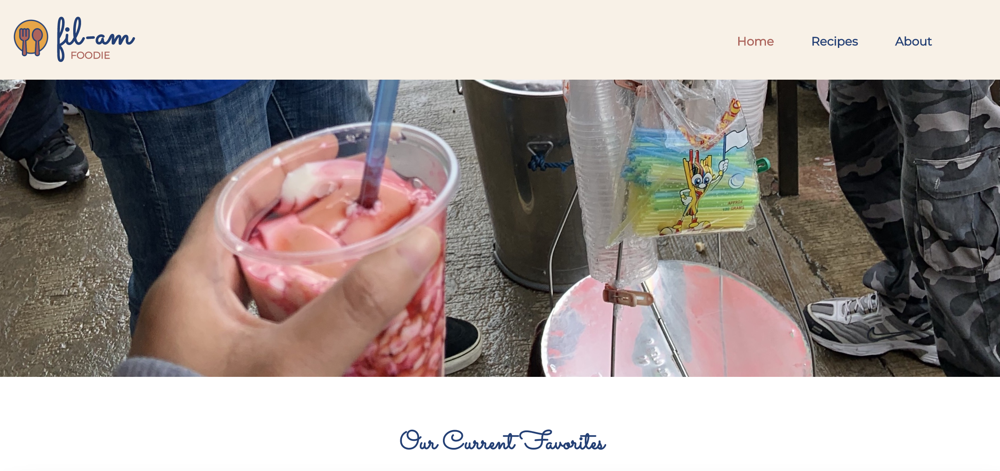

# Fil-Am Foodie

## Description 
Fil-Am Foodie is a recipe blog featuring Filipino and American dishes. Users can view recipes by category and leave comments and replies on each recipe page. 

## Screenshot 

## Technologies 
* MongoDB
* Mongoose 
* MongoDB Atlas
* Express API
* React 
* JavaScript 
* Node.js 
* HTML
* CSS

## Link
Check out the deployed application: https://www.filamfoodie.com

## Questions 
If you have any questions about the repo, open an issue or contact me directly at stfajardo@gmail.com. You can find more of my work at [stephfajardo.com](https://www.stephfajardo.com).
